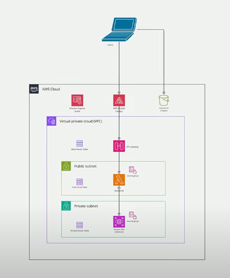
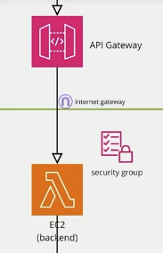
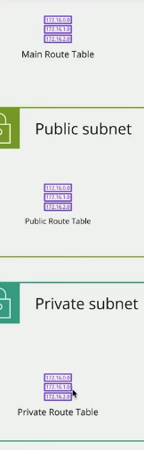
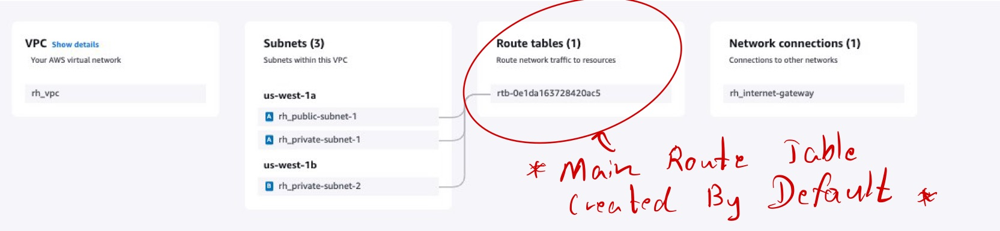
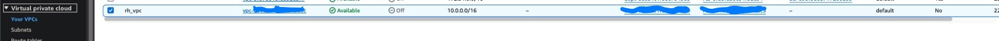
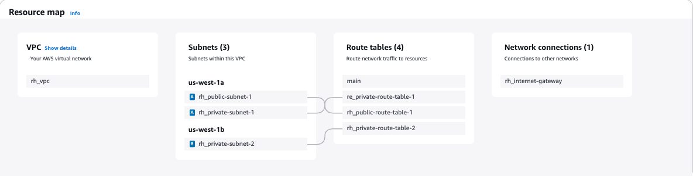
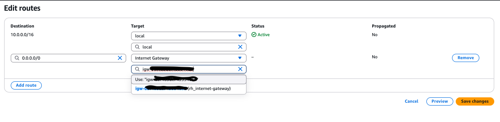
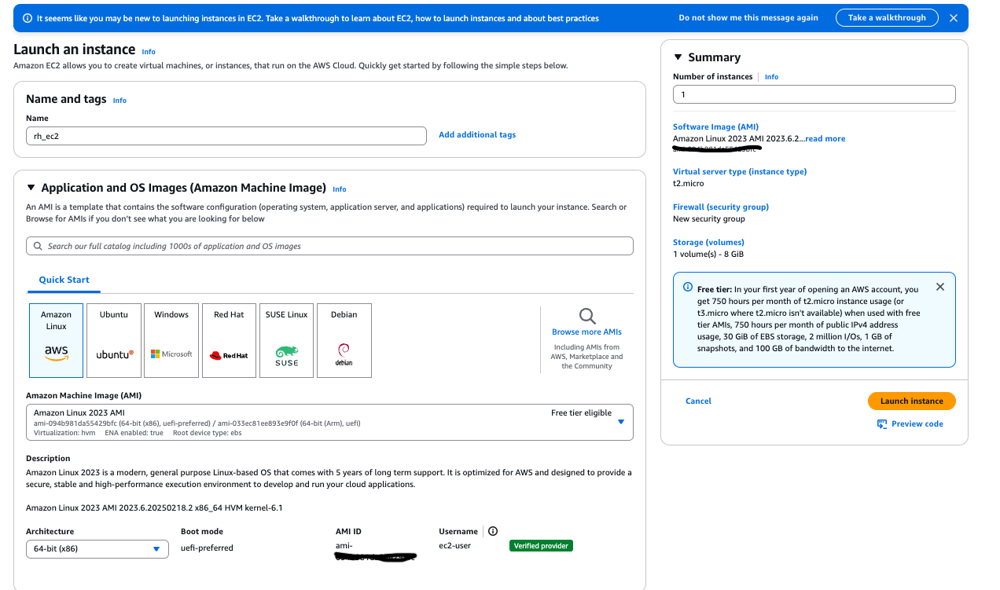
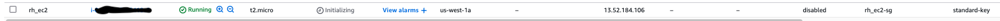
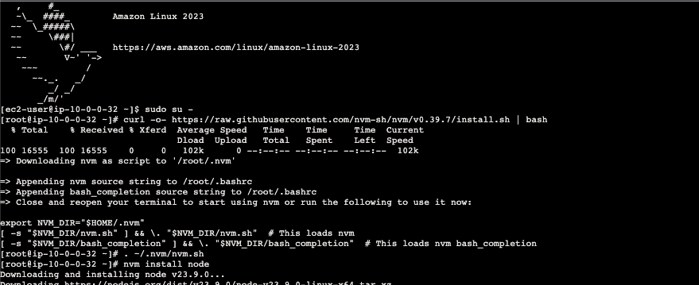

## AWS EC2 Architecture Work flow

  

- Public Subnet (API Gateway, Lambda) filters and handles requests. **Acting as a Security checkpoint (API Gateway & Lambda check your ticket and ID)**
- Private Subnet (Database) stores data securely, never exposed to the internet. **Only accessible through AWS lambda, where only verified passengers (secure requests) can enter.**
- No one can enter the VIP lounge **(Private Subnet)** directly from outside, only via the checkpoint. **Only trusted requests reach the private subnet.**

## Internet gateway before ec2 backend

  

- **Internet gateway** acts as a bridge between the AWS VPC (Virtual Private Cloud) and the internet, enabling resources in public subnets to:
    - Send outbound traffic (e.g., making API calls, downloading updates).
    - Receive inbound traffic (e.g., users accessing a web application).

## Route table

  

- Main Route Table available for **almost everything**
- Public Route Table available for **internet gateway**
- Private Route Table available for **ec2 backend**

## Before : Main Route table created in **AWS VPC** by default

  

- Main Route Table is created by default, it is used for all, public and private subnets. **But we want sepearte Route Table available for security purpose.**

## After : Creating different route tables for private and public subnets

  

  

***Note that: there will be two private subnets, one for main and one for backup incase main goes down.***

## Don't forget to connect public route table with internet gateway

  

## Yay now deploy on AWS EC2 for 12 MONTHS FREE, typing ec2 on AWS console and create instance.

  

  

<h1>Now try to deploy using CLI</h1>

  

