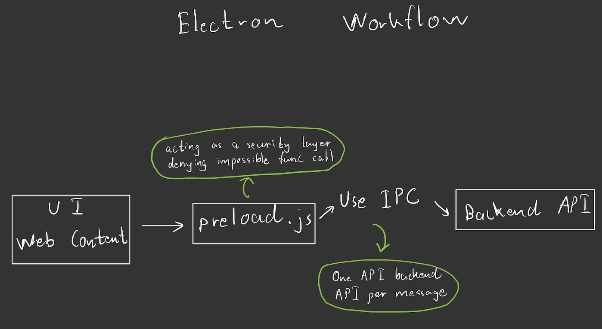

# Electron Workflow

### Unlike website, ELECTRON is run on two separate environments/worlds
* Main World for UI Web Content
* Isolated World for Main Process (Node.js Backend) 

## Important Steps to make your electron app less risky.

```bash
function createWindow() {
   webPreferences : {
     nodeIntegration : false,  //preventing node.js access to users
     contextIsolation : true, //preventing window/dom manipulation by users
   }
}
```

## If contextIsolation is set to default true by Electron
* Have to communicate through contextBridge inside preload.js 
* Use IPC (Interprocess communication) to request backend nodeAPI to do the task 
* Preload.js acting as a layer allowing specific task/function to call & one backend API func per message
* To prevent hackers access to global javascript window function to overwrite.

**IPC is acting as a walkie-talkie between preload.js and backend API function**

## If contextIsolation : false

* It shares the same window object meaning users can access the whole object without using Bridge. As a result, hackers can access to modify a Global Variable, resulting as below.


```bash
Before Modification:
window.userData = { name: "John Doe", isAdmin: false }; console.log(window.userData.isAdmin); // ✅ false

Hacker Injects Code:
window.userData.isAdmin = true; // ⚠️ Modifying global variable

After Modification:
console.log(window.userData.isAdmin) // ❌ Now prints `true`!
```

## Example case

Let’s say UI wants to schedule the zoom meeting, it talks to the preload.js directly without using IPC. Then, preload.js uses IPC (Inter Process Communication) to talk to the backend Node to do the zoom schedule meeting task. If successful, it can send back a “Success” message using IPC. 

## Electron Workflow

 


* zoomAutomation.js | Call From UI |

    ```bash
    const scheduleZoomMeetings = (timeSheet, zoomLink) => {
    if (!window.electronAPI) {
        console.error("🚨 window.electronAPI is undefined!");
        return;
    }
    window.electronAPI.scheduleZoom(timeSheet, zoomLink);
    };
    export { scheduleZoomMeetings };
    ```
* Preload.js
    ```bash
    const { contextBridge, ipcRenderer } = require('electron');
    contextBridge.exposeInMainWorld('electronAPI', {
    scheduleZoom: (timeSheet, zoomLink) => ipcRenderer.send('schedule-zoom', timeSheet, zoomLink)
    });
    ```
* main.js
    ```bash
    ipcMain.on('schedule-zoom', (event, timeSheet, zoomLink) => {
        console.log("Scheduling Zoom:", timeSheet);
        shell.openExternal(zoomLink); // ✅ Safe operation
    });
    ```

### Author : Aung Nanda Oo
